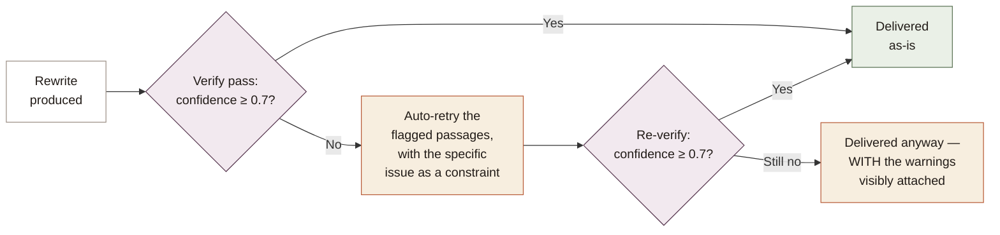
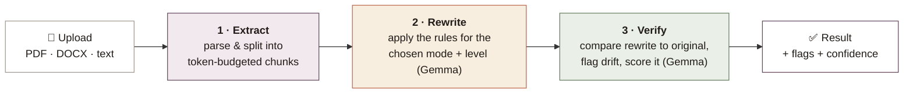
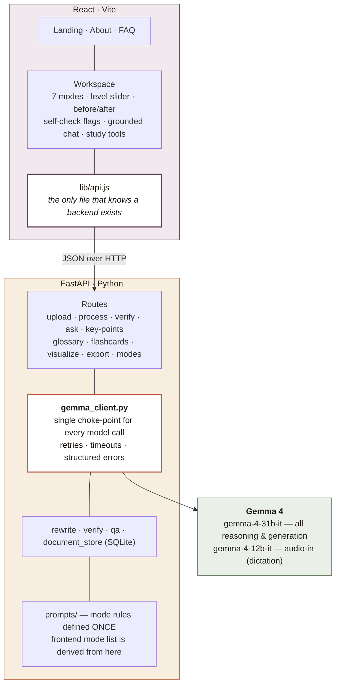

<div align="center">

# 📖 Lexi

### Text that adapts to *how you read* not the other way around.

**Every document assumes one kind of reader. Lexi rewrites it for the rest of us and checks its own work before it hands anything back.**

<p align="center">
  
</p>

<p align="center">
  
  
  
  
  
  
</p>

<p align="center">
  
  
  
</p>

<p align="center">
  <a href="YOUR_VIDEO_LINK_HERE"><strong>▶ Watch the 3-minute demo</strong></a>
</p>

<p align="center">
  <sub>
  <a href="#the-problem">The problem</a> ·
  <a href="#the-approach">The approach</a> ·
  <a href="#what-makes-it-different">What makes it different</a> ·
  <a href="#how-it-works">How it works</a> ·
  <a href="#architecture">Architecture</a> ·
  <a href="#the-seven-modes">Seven modes</a> ·
  <a href="#real-world-impact">Real-world impact</a> ·
  <a href="#why-gemma-is-the-whole-engine">Why Gemma</a> ·
  <a href="#tech-stack">Tech stack</a> ·
  <a href="#known-limitations">Limitations</a> ·
  <a href="#run-it-locally">Run it</a> ·
  <a href="#faq">FAQ</a>
  </sub>
</p>

</div>

<br/>

---

## The problem

Almost everything written down assumes the same reader: someone who can hold a long sentence in working memory, decode unfamiliar words on the fly and follow structure that exists only visually on the page.

A very large number of people do not read that way and the cost of ignoring them is not abstract.

 🧩 A student with **dyslexia**, facing forty pages of assigned reading where every long sentence destabilises comprehension.

 🌀 Someone with **ADHD**, who has reopened the same paragraph six times because it is an unbroken wall of text.

 🔊 A **screen-reader user**, handed a document whose structure exists only visually no real headings so it reads as a flat, shapeless stream by ear.

 🌍 A **non-native reader**, blocked not by the concepts, but by idiom, register and jargon.

 📋 Anyone standing in front of a **government form**, where a single misread line costs them a benefit they are owed.

The tools that exist treat all of this as one problem with one fix: a single **"Simplify"** button. But shortening sentences helps a dyslexic reader and does nothing for a screen-reader user who needs real headings. Chunking a wall of text helps someone with ADHD and is irrelevant to someone who simply needs the vocabulary translated.

**One output cannot serve opposite needs.**

And there is a second, quieter problem underneath the first. Simplification can silently change what a document *means* and the people who most need simplified text are the least equipped to notice when it has gone wrong. A confidently mis-simplified medical instruction or legal notice is more dangerous than the original.

---

## The approach

Lexi is built on two convictions that shape every part of it:

<table>
<tr>
<td width="50%" valign="top">

### 1 · Different barriers, different rewrites
Not the same output relabelled. Seven modes, each restructuring text along different axes: sentence length, ordering, emphasis, vocabulary, and how numbers and structure are presented.

</td>
<td width="50%" valign="top">

### 2 · A duty to say "I'm not sure"
Every rewrite is checked by a second pass that compares it against the original and flags where meaning may have drifted with a confidence score and both versions shown.

</td>
</tr>
</table>

The result is a reading tool that is willing to look *less* impressive flagging its own uncertainty instead of projecting false confidence because for the people it serves, that trade is the entire point.

---

## What makes it different

### 1 · Seven genuinely different rewrites not one, relabelled

The same paragraph comes out meaningfully different depending on who is reading it. This is the core thesis, and it is enforced by seven distinct rule sets, not seven tone presets.

<h3 align="center">The seven reading modes</h3>

<table align="center">
  <tr>
    <td align="center">🔤<br><strong>01</strong><br>Dyslexia-Friendly</td>
    <td align="center">🎯<br><strong>02</strong><br>Focus Mode</td>
    <td align="center">🔊<br><strong>03</strong><br>Screen Reader</td>
    <td align="center">🌍<br><strong>04</strong><br>Non-Native English</td>
  </tr>

  <tr>
    <td colspan="4" align="center">
      <table align="center">
        <tr>
          <td align="center">📋<br><strong>05</strong><br>Civic / Forms</td>
          <td align="center">🔢<br><strong>06</strong><br>Dyscalculia</td>
          <td align="center">⚡<br><strong>07</strong><br>ADHD-Friendly</td>
        </tr>
      </table>
    </td>
  </tr>
</table>

## 2 · It checks its own work

Most document AI systems follow a simple pattern: **read → rewrite → return**.

Lexi takes a different approach: **rewrite → verify → surface uncertainty**.

After every rewrite, a **second Gemma pass** independently compares the rewritten text against the original source. It looks for potential semantic drift changes in facts, numbers, conditions, negations, requirements or other details that could alter the original meaning. When a potential mismatch is detected, Lexi shows the **original and rewritten passages side by side**, together with a **confidence score**, so the user knows exactly where a second look is warranted.

> **Rewrite is not the finish line. Verification is part of the rewrite.**

For a birthday card, this level of checking would be unnecessary. But for a **medical instruction, legal notice, government form or document that affects access to support**, a fluent but incorrect simplification can be more harmful than leaving the original untouched.

That's what makes Lexi different: **it doesn't just make complex text easier to read, it makes the risks of that transformation visible.**


<details>
<summary><strong>🔍 What happens when confidence is low, specifically (click to expand)</strong></summary>
<br/>



Lexi never silently hides a low-confidence result the worst outcome for a reader who already struggles to catch errors is a wrong answer delivered with false confidence.

</details>

### 3 · Answers grounded in *your* document or an honest "I don't know"

Ask a question and the answer is drawn from your document, with the supporting line quoted back. If the answer isn't in the text, Lexi says so, rather than inventing one.

---

## How it works

<div align="center">
  
  <br/><em>A dense form, rewritten original on the left, rewrite on the right, readability deltas above.</em>
</div>

<br/>

Lexi runs a document through **three distinct passes** — read, rewrite, verify — rather than a single "make it simpler" call.



Everything downstream — grounded Q&A, key points, glossary, flashcards, and diagram generation — reuses the same extracted, chunked document.

---

## Architecture

A clean split: a **stateless FastAPI reasoning core** and a **provider-isolated React client**. Every AI capability is one HTTP call away, and the frontend never knows or cares which model sits behind the API.



<details>
<summary><strong>⚙️ Engineering decisions worth calling out</strong> (click to expand)</summary>
<br/>

- **One choke-point for the model.** Every Gemma call flows through `gemma_client.py`, which owns retries, timeouts, and structured error codes. Nothing else in the codebase talks to the model directly — so behaviour is consistent and testable across every AI feature.
- **Prompts defined once.** Mode rules live in `prompts/rewrite_prompts.py`; the frontend's mode list is served from `/modes`, derived from those same keys. Frontend and backend cannot drift out of sync.
- **The frontend is provider-agnostic by construction.** `lib/api.js` is the only file aware a backend exists. Point `VITE_API_BASE` elsewhere and nothing else moves.
- **Long documents are chunked to a token budget**, so each piece is rewritten with care rather than a whole document being loosely summarised — the difference between a rewrite and a lossy summary.
- **Verification always runs per-chunk**, never against the whole document at once — this keeps each audit call small, fast, and easy to reason about when something is flagged.

</details>

---

## The seven modes

Each mode is a genuinely different transformation, not a tone setting.

| # | Mode | What it changes |
|:-:|------|-----------------|
| 01 | 🔤 **Dyslexia-Friendly** | Short sentences, common words, one idea per line, generous spacing. |
| 02 | 🎯 **Focus Mode** | Key points surfaced first, bulleted structure, essentials in bold. |
| 03 | 🔊 **Screen Reader** | Real heading structure and speech-friendly punctuation for listening, not looking. |
| 04 | 🌍 **Non-Native English** | Plain vocabulary with idiom and jargon clarified inline. |
| 05 | 📋 **Civic / Forms** | Requirements, deadlines, fees, and steps pulled out of bureaucratic prose. |
| 06 | 🔢 **Dyscalculia** | Numbers, tables, and percentages explained in plain language. |
| 07 | ⚡ **ADHD-Friendly** | Small chunks, the most important action first, one action per line, nothing buried. |

On top of the mode sits a **1–5 simplification level** — *which barrier* and *how far to go* are separate questions, so they get separate controls.

---

## Everything you can do with a document

Once a document is loaded, every feature works from that same source:

| Feature | What it gives you |
|---|---|
| 🔁 **Adaptive rewrite** | Before/after comparison with readability deltas (grade level, words-per-sentence, sentence count) |
| ✅ **Self-verification** | Confidence score and flagged passages, side by side with the original |
| 💬 **Grounded Q&A** | Ask in English or Bangla, get answers from the document with the supporting excerpt |
| 📌 **Key points** | A short, skimmable summary generated on request |
| 📖 **Glossary** | Jargon detected and defined, grounded in how the document actually uses the term |
| 🗂️ **Flashcards** | Study cards generated from the document's own facts |
| 📊 **Diagram generation** | Flowcharts and charts, only when the content genuinely has structure worth drawing |
| 🔈 **Read aloud & dictation** | Browser speech engine for listening, and voice input for asking questions |
| 📤 **Export** | A branded PDF (full Bangla support) or plain text, to keep after the session ends |

---

## Real-world impact

Lexi is built for people, in a place, with a language — not for a demo.

**🇧🇩 It works in বাংলা, end to end.** The interface, the rewriting, and the grounded Q&A all operate in Bangla as well as English. For a reader in Bangladesh facing an English-heavy government form, or a Bangla document written in dense officialese, this is the difference between understanding a document and guessing at it. PDF export embeds Unicode fonts so Bangla survives the round-trip intact a detail most tools quietly get wrong.

**♿ The interface is itself an accessibility surface**, not a wrapper around one. Adjustable text size, relaxed line spacing, dark mode, full keyboard navigation and screen-reader labelling throughout. Body text is set in **Lexend**, a typeface independently designed to improve reading proficiency.

**🔒 Nothing is stored and nothing trains a model.** Documents live only for the length of a session and are never persisted or reused because the people most likely to paste in a medical letter or a legal notice are exactly the people who most need that guarantee.

The through-line: the readers Lexi is built for are usually an afterthought. Here they are the entire specification.

---

## Why Gemma is the whole engine

Nothing in Lexi works by keyword matching or hand-written rules. Every capability is real language reasoning:

- deciding *which* clause in a legal paragraph is the fragile one,
- rewriting for a specific cognitive barrier **without losing meaning**,
- judging whether a rewrite has drifted from its source,
- answering a question grounded in one specific document — and admitting when the answer isn't there.

**Every generative call in Lexi runs on Gemma 4.** Rewriting, verification, grounded Q&A, glossary, flashcards, key points, and visualisation — all of it. Dictation uses Gemma's audio-capable variant. Strip Gemma out and there is no fallback; there is nothing.

> 💡 **One honest note on retrieval.** For grounded Q&A, Lexi ranks document chunks with a hosted embedding model, because Gemma exposes no embedding endpoint. Embeddings are **not generative** — they encode text as vectors so the right passage can be located *before* Gemma answers from it. Every piece of reasoning and every word of output remains Gemma's.

---

## Tech stack

Every choice below was made for a reason not pulled in by default.

<details open>
<summary><strong>🐍 Backend - a stateless reasoning core</strong></summary>
<br/>

| Layer | Choice | Why |
|-------|--------|-----|
| **API framework** | FastAPI + Uvicorn | Async-native, so the many Gemma calls per document don't block; automatic OpenAPI docs at `/docs`. |
| **AI model** | Gemma 4 via Google AI Studio | The entire reasoning engine — hosted, so no local GPU is needed to run the project. |
| **HTTP client** | httpx | Async calls to the Gemma API, with retries and timeouts centralised in one client. |
| **Validation** | Pydantic v2 + pydantic-settings | Every request and response is a typed model; config loads from env, never hardcoded. |
| **Document extraction** | PyMuPDF · pdfplumber · python-docx | Layered PDF and DOCX text extraction — pdfplumber recovers tables PyMuPDF alone would miss. |
| **OCR** | pytesseract (Tesseract) | Recovers text from scanned pages and from PDFs with broken/legacy font encodings, where the text layer exists but doesn't decode to real characters. |
| **Storage** | SQLite | Session-scoped document store — zero-config, no external database to stand up. |
| **Export** | fpdf2 | Branded PDF export with embedded Unicode fonts, so **Bangla survives the export** intact. |
| **Tests** | pytest + pytest-asyncio | The async pipeline is covered by tests, not just run by hand — 31/31 passing. |

</details>

<details open>
<summary><strong>⚛️ Frontend — a provider-agnostic client</strong></summary>
<br/>

| Layer | Choice | Why |
|-------|--------|-----|
| **Framework** | React 18 + Vite | Fast dev loop; the component model suits the modular workspace. |
| **Routing** | React Router | Clean separation of the marketing pages and the tool itself. |
| **Diagrams** | Mermaid | Renders Gemma-generated flowcharts as real, in-browser diagrams. |
| **Typography** | Lexend · Fraunces · Poppins · Noto Sans Bengali | Lexend is independently designed to improve reading speed — an accessibility choice, not a cosmetic one. Noto Sans Bengali gives full বাংলা coverage. |
| **State & i18n** | Native React + a bilingual string layer | No heavyweight state library; EN / বাংলা handled in one `strings.js`. |
| **API isolation** | A single `lib/api.js` | The only file that knows a backend exists — the whole provider can be swapped from one place. |

</details>

---

## Known limitations

Being upfront about the edges of the system, rather than papering over them:

- 📊 **Diagram generation is intentionally conservative.** If a document's content doesn't genuinely suit a flowchart or chart, Lexi says so rather than forcing a visualization onto unsuitable text.
- ✅ **Verification is an audit, not a guarantee.** The confidence score reflects how well Gemma's own comparison pass caught drift — it materially reduces (but does not eliminate) the risk of a silently wrong simplification, which is why both versions are always shown, not just the rewrite.
- 🔒 **No persistent user accounts.** By design — session-scoped storage is a privacy choice, not a missing feature (see [Real-world impact](#real-world-impact)).

---

## Run it locally

### 1 · Backend

```bash
cd lexi-backend
python -m venv venv
venv\Scripts\activate            # Windows  ·  source venv/bin/activate on macOS/Linux
pip install -r requirements.txt

copy .env.example .env           # macOS/Linux: cp .env.example .env
```

Open `.env` and set your key:

```
GEMMA_API_KEY=your_key_here      # from https://aistudio.google.com/apikey
ALLOWED_ORIGINS=http://localhost:5173,http://localhost:3000
```

**For OCR**, also install Tesseract as a system binary (not just the Python wrapper):

```bash
# Ubuntu/WSL
sudo apt-get install tesseract-ocr tesseract-ocr-ben   # ben = Bangla language pack
# macOS
brew install tesseract
```

```bash
uvicorn app.main:app --reload --port 8000
```

Visit `http://localhost:8000/health` — a green `"reachable"` means Gemma is wired up.

Run the test suite:

```bash
pytest
```

### 2 · Frontend

```bash
cd lexi
npm install
npm run dev                      # http://localhost:5173
```

---

## Project structure

```
.
├── lexi-backend/                FastAPI backend
│   ├── app/
│   │   ├── api/                 route handlers (one file per endpoint)
│   │   ├── services/            gemma_client · rewrite · verify · qa · document_store
│   │   ├── prompts/              mode rules + few-shot examples (single source of truth)
│   │   ├── schemas/              Pydantic request/response models
│   │   └── config.py             all tunables, loaded from .env
│   ├── tests/                    pytest suite — 31/31 passing
│   └── requirements.txt
│
└── lexi/                        React frontend
    └── src/
        ├── pages/                Landing · About · FAQ · AppPage
        ├── components/           workspace, modes, result view, chat, history…
        └── lib/                  api.js (provider isolation) · strings.js (EN/বাংলা)
```

---

## FAQ

<details>
<summary><strong>Does Lexi change the meaning of my document?</strong></summary>
<br/>
Never intentionally, and rarely by accident — every rewrite is checked by a second Gemma pass that compares it against the original and flags anything that may have drifted. You always see both versions, so you never have to just trust the rewrite blindly.
</details>

<details>
<summary><strong>What happens to my document after I upload it?</strong></summary>
<br/>
It lives only for the length of your session. Nothing is persisted after that, and nothing is used to train any model.
</details>

<details>
<summary><strong>Why seven modes instead of one "simplify" button?</strong></summary>
<br/>
Because the needs are genuinely different, not just different intensities of the same thing. Short sentences help a dyslexic reader; that does nothing for a screen-reader user who needs real headings. See <a href="#the-problem">The problem</a> for the full case.
</details>

<details>
<summary><strong>Does it really work in Bangla, or is that just the interface?</strong></summary>
<br/>
End to end — rewriting, grounded Q&A, and PDF export (with embedded Unicode fonts so the text survives the round-trip) all work in Bangla, not just the UI chrome.
</details>

---

<div align="center">

**Lexi** · Reading, on your terms.

</div>
